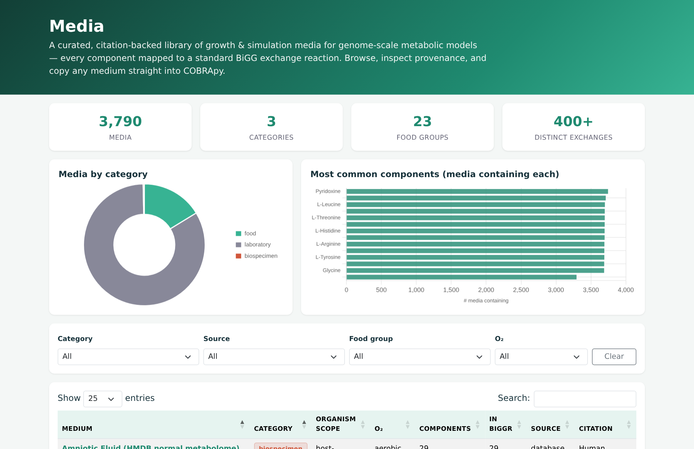
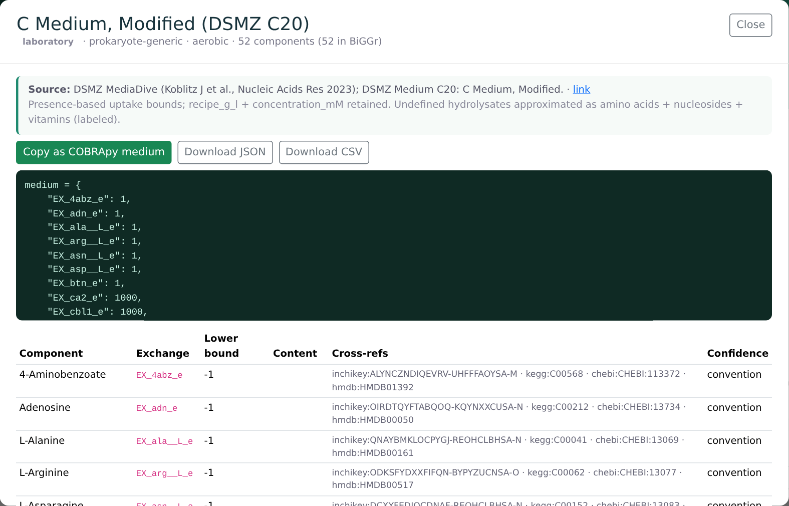
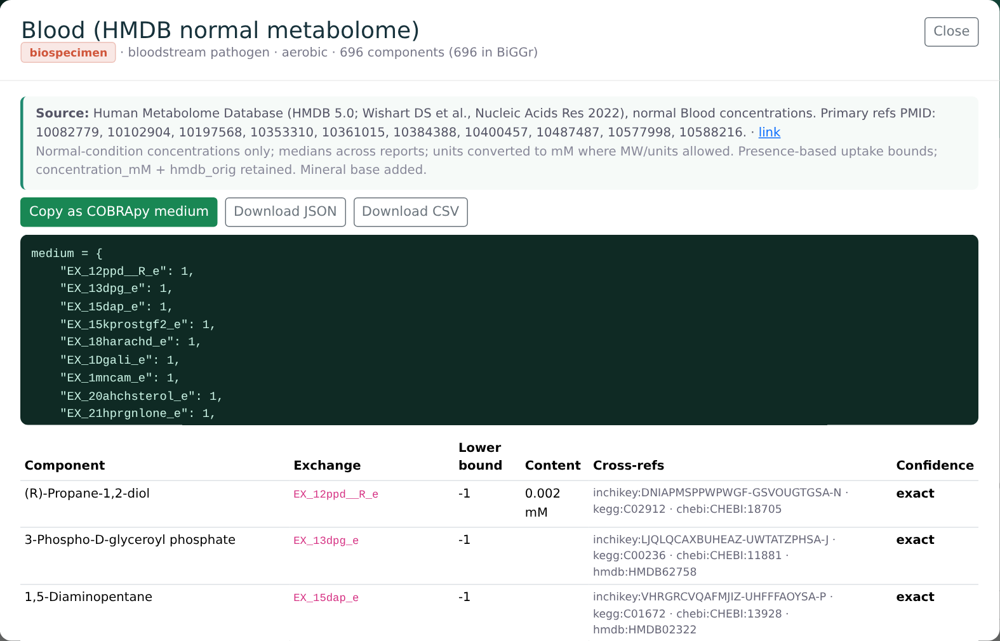
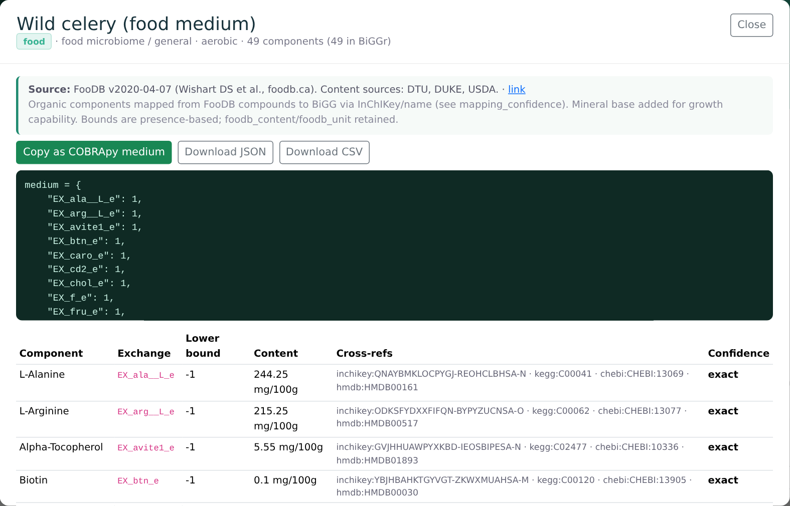

# Media

**A curated, citation-backed library of growth & simulation media for genome-scale
metabolic models — every component mapped to a standard BiGG exchange reaction.**

Reusing a published medium in a genome-scale metabolic model (GEM) usually means
re-reading the paper and re-mapping every compound into your model's namespace by hand.
`Media` does that once, transparently: each medium is a machine-readable record where
every component is mapped to a BiGG exchange (`EX_<met>_e`), carries cross-references
(InChIKey / ChEBI / KEGG / HMDB / MetaNetX / SEED), and the whole medium carries a
**citation**.

> `Media` is the first repo in a suite of GEM **validation-data** resources — a long-standing
> gap in the field. Planned siblings: growth / uptake / production rates, ¹³C-MFA flux data,
> transcriptomics for reaction constraints, biomass compositions, and Biolog phenotyping,
> for as many prokaryotes as possible.

## Explore it online

An interactive browser — search and filter every medium, inspect each component's cross-references and mapping confidence, and **copy any medium straight into COBRApy**. Runs entirely in your browser.

<table>
<tr>
<td width="50%"><a href="https://omidard.github.io/Media/"></a></td>
<td width="50%"><a href="https://omidard.github.io/Media/"></a></td>
</tr>
<tr>
<td width="50%"><a href="https://omidard.github.io/Media/"></a></td>
<td width="50%"><a href="https://omidard.github.io/Media/"></a></td>
</tr>
</table>

<p align="center">
  <em>Laboratory / defined media (DSMZ) &middot; biospecimen media (HMDB) &middot; food-derived media (FooDB) &middot; every component cited &amp; mapped to BiGG</em><br><br>
  <a href="https://omidard.github.io/Media/"></a>
  &nbsp;&nbsp;<a href="https://omidard.github.io/Media/"><code>omidard.github.io/Media</code></a>
</p>

---

## What's here

```
Media/
├── data/
│   ├── media/            # one cited JSON record per medium
│   └── index.json        # aggregate index (browser + programmatic use)
├── tools/
│   ├── map_metabolite.py         # name / xref → BiGG exchange mapper (auditable)
│   ├── bigg_metabolite_dict.json # 9,403 BiGG metabolites + xrefs (3,773 in BiGGr)
│   └── bigg_reverse_index.json   # reverse indexes (by name and each xref)
├── index.html            # interactive browser (GitHub Pages, served from root)
├── DESIGN.md             # schema, conventions, provenance & mapping rules
└── README.md
```

Each record: see **[DESIGN.md](DESIGN.md)**. Every component records **how** it was mapped
(`mapping_method`) and **how confident** that mapping is (`exact` via cross-reference,
`inferred` via name, or `manual`). Compounds that can't be mapped are listed in `unmapped`,
never dropped silently.

## Use a medium (COBRApy)

```python
import json, cobra
med = json.load(open("data/media/m9_glucose_aerobic.json"))
model = cobra.io.load_json_model("my_strain.json")
model.medium = {c["exchange"]: -c["lower_bound"] for c in med["components"]
                if c["exchange"] in model.reactions}
print(model.slim_optimize())
```

## Current contents

**3,790 media** and growing, each cited and mapped through the same pipeline:

| Category | Count | Sources |
|---|---:|---|
| **Laboratory** (defined & complex culture media) | **3,162** | **DSMZ MediaDive** (3,148 recipes; Koblitz *et al.*, NAR 2023) + classic media (LB, TSB, BHI, blood agar, M9 / MOPS / M63 / Davis) |
| **Food** (one medium per food) | **616** | **FooDB** (measured food composition) |
| **Biospecimen** (per biofluid) | **12** | **HMDB 5.0** — Blood, Urine, Feces, Saliva, CSF, Sweat, Breast Milk, Bile, Amniotic Fluid (normal metabolome) + serum/urine/faeces from PLOS Pathog 2025 |

Defined media map every compound to a BiGG exchange with concentrations (salts dissociated
to their ion exchanges); complex media map their defined portion and render undefined
hydrolysates (peptone, extracts) as a clearly-labelled in-silico approximation with the real
ingredients listed in `unmapped`. Still incoming: USDA FoodData Central, bovine/rumen
biofluids (BMDB), KOMODO/MediaDB, and large-scale mining of the GEM literature.

## Contributing a medium

Open an issue or PR with: the formulation (compounds + concentrations or uptake bounds),
the **citation**, and the organism scope. The mapper + a review pass will map it to BiGG
and record provenance. See [DESIGN.md](DESIGN.md).

## Mapping backbone & attribution

Cross-references are built from the [BiGG Models](http://bigg.ucsd.edu) namespace and
resolved against the local BiGGr prokaryote universal reactome. Please cite the original
source of any medium you use (given in each record's `provenance`).

## License

Data: **CC-BY-4.0**. Code (`tools/`, `docs/`): **MIT**. See [LICENSE](LICENSE).
