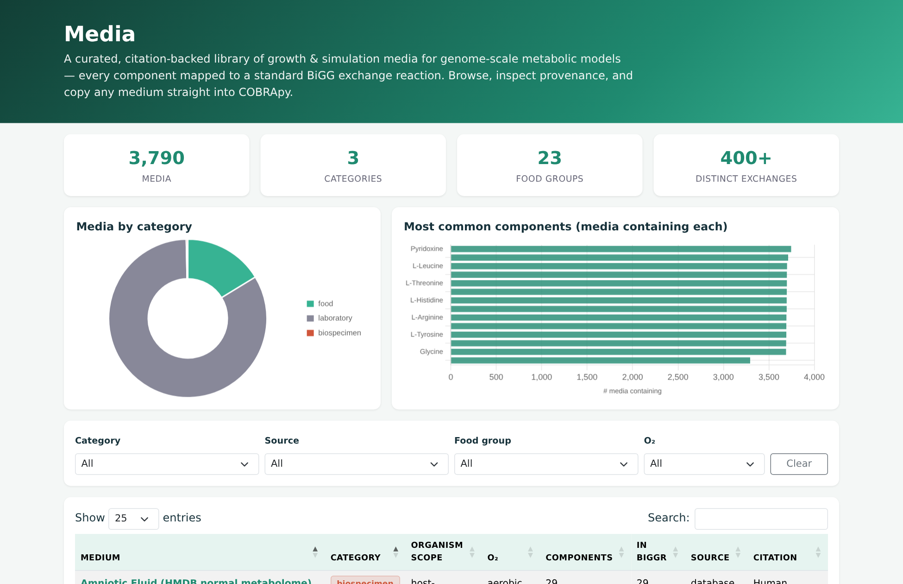
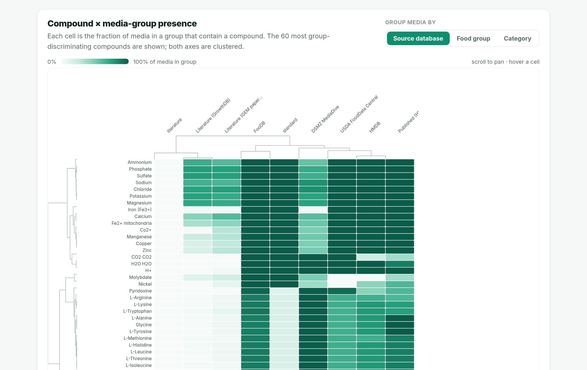
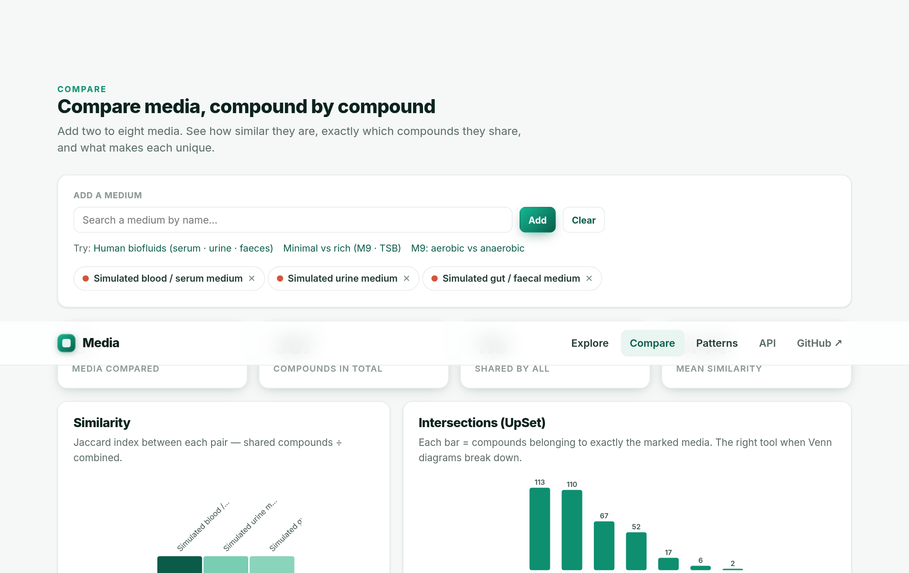
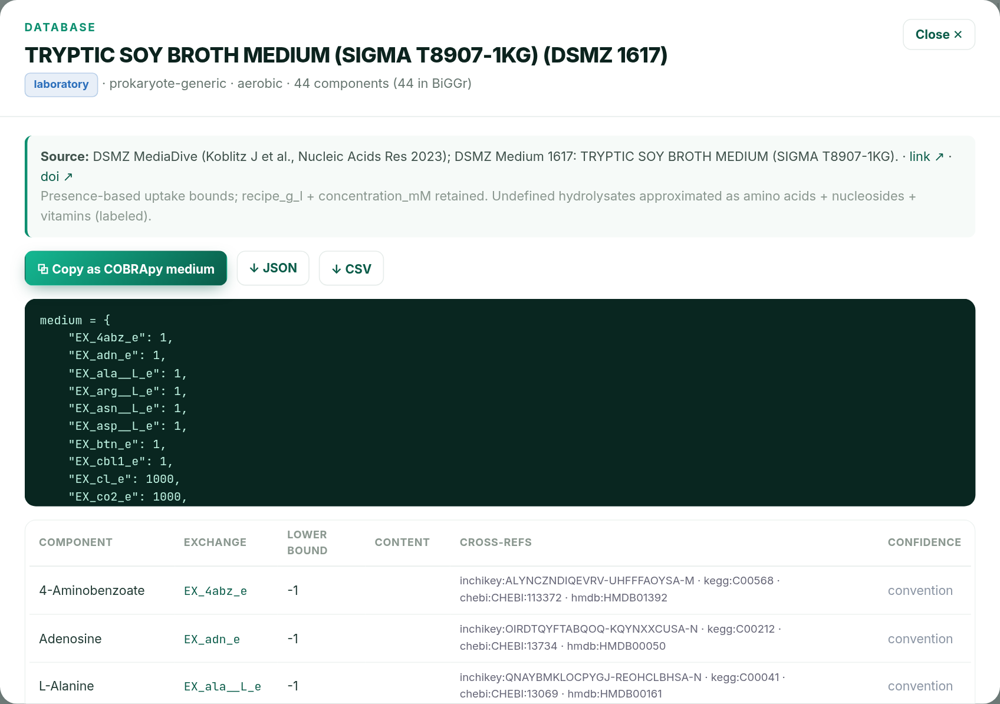

# Media

**In silico media for genome-scale metabolic models: 13,515 laboratory, food and
biospecimen compositions re-encoded as BiGG exchange reactions.**

Reusing a published medium in a genome-scale metabolic model (GEM) usually means
re-reading the paper and re-mapping every compound into your model's namespace by hand.
`Media` does that once: each medium is a machine-readable record whose components carry a
BiGG exchange (`EX_<met>_e`) and, for most of them, cross-references (InChIKey / ChEBI /
KEGG / HMDB / MetaNetX / SEED), and the whole medium carries a **citation**.

Component coverage, measured:

| | |
|---|---|
| Components reaching a BiGG exchange | **664,000 of 665,582 (99.8%)**. 1,364 carry a ModelSEED/MetaNetX/KEGG fallback id that **no BiGG model will accept** — their own `mapping_note` says so — and 218 carry no exchange at all. |
| Components carrying a cross-reference | **656,625 of 665,582 (98.7%)**. 8,957 (1.3%) carry none. |

> **13,515 media** and counting — laboratory culture media, food-derived media, host
> biofluids, and formulations mined from the primary literature — assembled from **DSMZ
> MediaDive, FooDB, USDA FoodData Central, HMDB, BMDB**, and **1,457 records whose source
> is a primary publication** (GrowthDB 1,369 + 88 from genome-scale-model papers;
> 916 distinct citation strings; 73 DOIs recorded and 834 PMC ids recovered, 907 distinct
> works), all in one consistent, cited, BiGG-mapped format.
>
> That 1,457 is a *source attribution*. The permanently-unreproducible set is a different
> 1,456 records, defined by the extraction batch a composition came from rather than by
> who published it (below); the two differ by one record. Every population
> this repository calls "literature" is measured with the predicate that defines it in
> `data/index.json` → `literature_populations`.

## Explore it online

An interactive browser — search and filter every medium, inspect each component's cross-references and mapping confidence, and **copy any medium straight into COBRApy**. Runs entirely in your browser.

<table>
<tr>
<td width="50%"><a href="https://omidard.github.io/Media/"></a></td>
<td width="50%"><a href="https://omidard.github.io/Media/patterns.html"></a></td>
</tr>
<tr>
<td width="50%"><a href="https://omidard.github.io/Media/compare.html"></a></td>
<td width="50%"><a href="https://omidard.github.io/Media/"></a></td>
</tr>
</table>

<p align="center">
  <em>Explore the library &middot; clustered composition patterns &middot; side-by-side comparison &middot; and every medium copyable straight into COBRApy</em><br><br>
  <a href="https://omidard.github.io/Media/"></a>
  &nbsp;&nbsp;<a href="https://omidard.github.io/Media/"><code>omidard.github.io/Media</code></a>
</p>

---

## What's here

```
Media/
├── data/
│   ├── media/            # one cited JSON record per medium
│   └── index.json        # aggregate index (browser + programmatic use)
├── tools/
│   ├── map_metabolite.py         # name / xref → BiGG exchange mapper (auditable)
│   ├── bigg_metabolite_dict.json # 9,403 BiGG metabolites + xrefs (3,773 in BiGGr)
│   └── bigg_reverse_index.json   # reverse indexes (by name and each xref)
├── index.html            # interactive browser (GitHub Pages, served from root)
├── DESIGN.md             # schema, conventions, provenance & mapping rules
└── README.md
```

Each record: see **[DESIGN.md](DESIGN.md)**. Every component records **how** its identity
was decided, in `evidence_tier` — one of twelve recorded tiers, grouped into six classes
ordered by the strength of the evidence. No evidence class is labelled `exact`: a
hard-coded English-name lookup (`name_table`) and a cross-referenced match
(`structural_xref`) are separate tiers in separate classes. What each class rests on,
measured:

| Evidence class | Components |
|---|---:|
| Structure-verified (a structural cross-reference decided it) | 2,756 of 665,582 (0.4%) |
| Identifier-verified (a database id or a reviewed curation table) | 3,610 of 665,582 (0.5%) |
| Name-matched (a name string, no structure and no identifier checked) | 327,218 of 665,582 (49%) |
| Class or assertion (a class collapsed onto one molecule, or asserted) | 102,294 of 665,582 (15%) |
| Pipeline-derived (the cited source never states it) | 229,486 of 665,582 (34%) |
| Unresolved | 218 of 665,582 (<0.1%) |

A compound with no BiGG mapping is listed in the record's `uncovered` array.

**Half this library is degenerate as a model input.** 6,827 of 13,515 records (50.5%) hand a
model the identical set of `(exchange, lower_bound, upper_bound)` triples as at least one
other record — 1,623 groups, the largest holding 93 media. Adding each component's
source-stated concentration, a stricter test than any solver applies, still leaves 6,328
(46.8%). Most bounds here are presence placeholders rather than measured rates, so recipes
differing in amount, pH, agar or preparation collapse onto one constraint set. Records are
not deduplicated by model input: each keeps its own provenance, each carries
`n_media_with_identical_model_input` and `model_input_signature`, and the complete groups
are published at `data/web/twins.json`.

## Use a medium (COBRApy)

```python
import json, cobra
med = json.load(open("data/media/m9_glucose_aerobic.json"))
model = cobra.io.load_json_model("my_strain.json")
model.medium = {c["exchange"]: -c["lower_bound"] for c in med["components"]
                if c["exchange"] in model.reactions}
print(model.slim_optimize())
```

## Programmatic access (data API)

Everything here is a **read-only static API** over GitHub Pages — plain HTTPS `GET`s
with permissive CORS, so you can fetch from Python, R, JS, or `curl` with no key and no
rate limit. Full reference in **[`API.md`](./API.md)** (+ machine-readable
[`openapi.yaml`](./openapi.yaml)).

```
GET  data/index.json              # catalog: counts + one summary per medium
GET  data/media/{id}.json          # full record for one medium
GET  data/api/media.parquet        # bulk: one row per medium
GET  data/api/components.parquet    # bulk: one row per (medium, component)
GET  data/refs.json                # cross-reference + note tables (join on xref_id)
GET  data/api/manifest.json         # version, totals, file inventory, schemas
```

The gzipped SQLite database and the JSON Lines shards are **not served from this
host**: GitHub Pages publishes the repository root and refuses a published site over
1 GiB, and both are a re-encoding of `data/media`, which stays published because the
browser fetches `data/media/{id}.json` at runtime.

**Both files are hosted on the [`data-v1` release](https://github.com/omidard/Media/releases/tag/data-v1).**
`data/api/manifest.json` → `bulk_download.status` reads `published` and carries the
asset URLs and their sha256 sums; `pymediadb` streams from the release and falls back
to the per-medium endpoint if an asset is unreachable. You can also rebuild them
yourself — the corpus they re-encode ships in this repository, so the build is
offline and takes one command:

```bash
git clone https://github.com/omidard/Media && cd Media
make release-assets     # -> dist/api/media.sqlite.gz, media.jsonl.part01.gz
                        #    + RELEASE_NOTES.md with sizes, sha256s and the corpus id
```

Nothing is exclusive to those files: every full record is served one at a time at
`data/media/{id}.json`, and `pymediadb.iter_full_records()` streams the whole corpus
from there.

Query the bulk Parquet in place, without downloading, via DuckDB:

```python
import duckdb
con = duckdb.connect(); con.execute("INSTALL httpfs; LOAD httpfs;")
B = "https://omidard.github.io/Media/data/api"
con.sql(f"SELECT category, count(*) FROM read_parquet('{B}/media.parquet') GROUP BY 1")
```

Or use the ready-made client (filters, `to_cobra_medium`, cached fetch):

```bash
pip install "git+https://github.com/omidard/Media.git#subdirectory=client"
```
```python
from pymediadb import MediaDB
db = MediaDB()
db.list_media(category="laboratory", defined=True)
db.to_cobra_medium(db.get_medium("m9_glucose_aerobic"))
```

Rebuild the derived artifacts after new media land: `make derived`. See
[How this is built](#how-this-is-built) — the build has one entrypoint, and the
workflow calls the same targets, so the docs and CI cannot drift apart.

## Current contents — 13,515 media

Counted from `data/media/*.json`, which is the authority: every other total in the
repository is generated from it (`make derived`) and checked against it
(`python3 tools/verify_counts.py`). Grouping below is now by the source identity
**read from each record** (`provenance.source_name`, resolved by the
`20_stamp_provenance` stage), not by what the id prefix implies — the prefix filed
1,248 JCM and CCAP formulations under DSMZ. The table is `by_source_db` in
`data/index.json`, so it cannot drift from the catalogue.

| Source | Media | Licence | What it contributes |
|---|---:|---|---|
| **USDA FoodData Central** | 7,424 | CC0-1.0 | food media from analytically-measured composition (Foundation + SR Legacy) |
| **DSMZ MediaDive** | 3,148 | CC BY 4.0 | culture-media recipes (Koblitz *et al.*, NAR 2023). MediaDive redistributes other collections: 1,900 are DSMZ's own, 1,143 are JCM (RIKEN) and 105 are CCAP, recorded per record in `provenance.collection` |
| **Primary literature via GrowthDB** | 1,369 | CC BY 4.0 | formulations mined from growth-rate papers (defined and complex) |
| **FooDB** | 701 | CC BY-NC 4.0 | one medium per food (measured food composition) — **non-commercial** |
| **MediaDB (ISB defined media)** | 471 | all rights reserved | defined media from the ISB MediaDB. **No reuse grant is stated upstream and redistribution permission has not been obtained** (see below) |
| **Classic and standard formulations (project-curated)** | 297 | CC BY 4.0 | LB, TSB, BHI, blood agar, M9 / MOPS / M63 / Davis and the canonical reference set |
| **Primary literature (GEM papers)** | 88 | CC BY 4.0 | formulations mined from primary GEM papers |
| **Human Metabolome Database (HMDB 5.0)** | 9 | CC BY-NC 4.0 | host biofluids — **non-commercial** |
| **Bovine Metabolome Database (BMDB)** | 5 | permission required | bovine biofluids |
| **HMDB tables republished in an open-access paper** | 3 | CC BY-NC 4.0 | host biofluids — **non-commercial** |
| **total** | **13,515** | | |

The **licence column above is the upstream position**, which is what `NOTICE` credits. The
compilation as a whole is licensed **CC BY-NC 4.0**, set at the most restrictive of those
inputs; there is no per-record licence field.

**On the 471 MediaDB (ISB) records, stated plainly.** The only statement on
`mediadb.systemsbiology.net/defined_media/` (read 2026-09-06, first-party) is
"(c) 2014, Institute for Systems Biology, All Rights Reserved". **No reuse grant of any
kind is offered upstream, and redistribution permission has not been obtained.** They are
published under `mdb_*` identifiers with `provenance.source_name`
"MediaDB (ISB defined media)" so they can be identified, and they hold 8,397 of 14,055
non-null concentration values (59.7%), the largest single share in the library. Permission
is being sought (contact: mediadb@systemsbiology.org).

Categories: **laboratory** 5,373, **food** 8,125, **biospecimen** 17. (`growth_medium`,
a second-generation label carried by 443 laboratory records, is merged into
`laboratory` by the schema stage.)

Defined media map their compounds to BiGG exchanges (salts dissociated to their ion
exchanges); complex media map their defined portion and render undefined hydrolysates
(peptone, extracts) as a clearly-labelled in-silico approximation, with the real ingredients
listed in `uncovered`. Where a compound reached no BiGG id the record states it per
component and counts it in `n_nonbigg_fallback` and `n_no_exchange`.

## How this is built

`data/media/*.json` is the only copy of the corpus: the upstream payloads it was built
from were not retained. 1,456 literature-derived records (`lit_`, `growthlit_`,
`complexlit_`) come from LLM extractions whose batch files no longer exist, and a fresh
extraction would file *different* compositions under the *same* citations, so that miner
is not re-run.

That has two consequences, and they shape everything:

1. **`data/media/` is a frozen snapshot.** It is not regenerable from its sources.
   `data/MANIFEST.json` records that explicitly, with the measured split between what is
   recoverable in principle (~87%, public upstreams) and what is not (1,456 records).
2. **Corrections are transform stages, never edits.** A correction is a program under
   `tools/stages/` that reads a corpus directory and writes a corrected corpus directory;
   `tools/stages/run_stages.py` composes them in a fixed, registered order and enforces the
   universal invariants after every stage. See
   [tools/stages/README.md](tools/stages/README.md) for the contract.

```bash
make check          # the stage registry and tools/stages/ agree
make baseline       # expand + verify the chain's input (data/_baseline, 3.7 MB)
make sample         # deterministic 165-record sample corpus, drawn from that input
make stages-sample  # run the chain over the sample (fast; checks idempotence)
make stages         # run the chain over all 13,515 media -> data/_rebuild/media
make reproduce      # run the chain and compare the result to the shipped corpus
make test           # schema, invariants, defect ledger, harness, build tools
make derived        # rebuild index/stats/coverage/api/cluster/presence/web + MANIFEST
make verify         # rebuild the catalogue into a temp dir and compare totals
make preflight      # every check CI runs, in CI's order — run this before pushing
make promote        # back up data/media, then promote the corrected corpus over it
```

`make promote` is the only command that writes `data/media/`, and it backs the corpus up
first, refuses a corpus the runner did not produce, and never deletes a record.

[`docs/PUSH_CHECKLIST.md`](docs/PUSH_CHECKLIST.md) is the order to run these in before a
push, and it carries the one thing still outstanding afterwards: the `data-v1` release
that will host the bulk SQLite and JSONL exports has not been created yet, so those two
files are built locally (`make release-assets`) and every document says so.

### What a fresh clone can and cannot reproduce

The chain's **input ships with the repository**: `data/_baseline/media_corpus_2026-09-06.tar.xz`,
3.7 MB, expanding to the 13,515 pre-remediation records (443 MB) that the correction
stages were written against. `make baseline` expands and digest-verifies it;
`tools/baseline.py --check-history` cross-checks it against the same corpus in this
repository's own history. Until it was committed, `make stages` and `make stages-sample`
were documented here as runnable and both failed: the only input was an untracked archive
on one machine, which is finding PIPE-01 — builders pointing at a path that is not in the
repository — recreated one level up, in the targets that exist to fix PIPE-01.

So, precisely:

| From a clone alone | Reproducible? |
|---|---|
| every correction the remediation applied, over all 13,515 records (`make reproduce`) | **yes** — byte for byte against the shipped `data/media` |
| every derived artifact: index, stats, coverage, API exports, clustergram, browser payload, manifest (`make derived`) | **yes** |
| the corpus from its upstream sources | **no** — the raw inputs are gone (PIPE-01); ~87% is re-fetchable as a *source-version delta*, not a reproduction, and 1,456 literature-derived records are permanently unreproducible |

`make reproduce` sets `MEDIADB_STAMP_DATE` to the date the shipped corpus carries, because
the chain stamps each record with the day it ran. Without it the only difference between a
reproduction and the published corpus would be today's date — and a check that has to
ignore a field is weaker than one that does not.

### Re-acquiring the sources

```bash
python3 tools/fetch_sources.py --list      # what each source is, and its licence
python3 tools/fetch_sources.py --all       # re-fetch everything that is public
```

Downloads land in `data/_sources/` (gitignored). What *is* committed is
`data/_sources/MANIFEST.json`: per source, the URL, the HTTP status actually observed, the
retrieval date, the sha256 and the licence — and, for the sources that cannot be
re-acquired, an explicit `"status": "lost"` with the reason. Absence is recorded, not
implied.

## Contributing a medium

Open an issue or PR with: the formulation (compounds + concentrations or uptake bounds),
the **citation**, and the organism scope. The mapper + a review pass will map it to BiGG
and record provenance. See [DESIGN.md](DESIGN.md).

## Mapping backbone & attribution

Cross-references are built from the [BiGG Models](http://bigg.ucsd.edu) namespace and
resolved against the local BiGGr prokaryote universal reactome. Please cite the original
source of any medium you use (given in each record's `provenance`).

## License

* **Data**: **CC BY-NC 4.0** ([terms](https://creativecommons.org/licenses/by-nc/4.0/)).
  One licence for the whole compilation, set at the most restrictive upstream input; see
  [`LICENSE`](LICENSE). Attribution owed upstream is in [`NOTICE`](NOTICE).
* **Code** (`tools/`, `client/`, `build_index.py`, the site's HTML/CSS/JS): **MIT**.

Cite each medium's original source, given in its `provenance.citation`. A record here is an
encoding of somebody else's composition.
